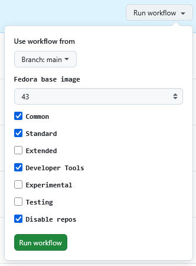

# HorizonOS


A custom Fedora image based on Kinoite and built with Universal Blue template.

## Features

- a bunch of [cli tools](./build_scripts/standard/packages.sh)
- media codecs from [RPM Fusion](https://rpmfusion.org/)
- selected [KDE apps](./build_scripts/standard/kde-apps.sh)
- Cockpit, Tailscale, Syncthing, Sunshine, Thunderbird, VLC preinstalled
- dev tools: QEMU, dotnet, VSCode
- Flathub with [selected packages](./sys_files/usr/bin/setup-flatpak.sh)
- my custom colors and icons
- scheduled to update weekly
- designed to be modular (fork the repo to try!)



## Howto

- install standard [Fedora Kinoite](https://fedoraproject.org/atomic-desktops/kinoite/download)
- upgrade

```bash
sudo rpm-ostree upgrade
```

- reboot
- pin current version (optional - to go back easily to standard Kinoite)

```bash
sudo ostree admin pin 0
```

- install

```bash
sudo bootc switch ghcr.io/itotm/horizon-os:latest
```

- reboot (**note**: after the first reboot, wait until Flatpak apps finish installing)

## AI disclaimer

Some scripts written and/or modified by Claude and Copilot.

---

[](https://github.com/itotm/horizon-os/actions/workflows/build.yml)

[](https://github.com/itotm/horizon-os/actions/workflows/build-disk.yml)