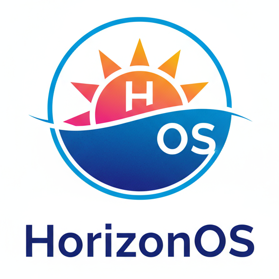
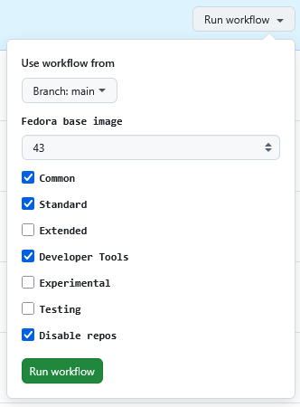

# HorizonOS



A custom bootc image built with Universal Blue template and based on Fedora Kinoite.

## Features

- [my](https://github.com/itotm) custom colors, icons, Plymouth theme, Plasma widgets
- [cli tools](./build_scripts/standard/packages.sh)
- media codecs from [RPM Fusion](https://rpmfusion.org/)
- [KDE apps](./build_scripts/standard/kde-apps.sh)
- [Apps](./sys_files/usr/libexec/horizon-install-flatpaks) from Flathub (removed Fedora flatpak repository)
- Cockpit, QEmu, Distrobox, Sunshine, VSCode, Syncthing and Tailscale preinstalled
- Italian locales and various dictionaries
- [CachyOS kernel](https://copr.fedorainfracloud.org/coprs/bieszczaders/kernel-cachyos/)
- scheduled to update weekly
- designed to be modular (fork the repo to try!)



## Howto

- install [Fedora Kinoite](https://fedoraproject.org/atomic-desktops/kinoite/download)
- pin current version (optional - to go back easily)

```bash
sudo ostree admin pin 0
```

- install

```bash
sudo bootc switch ghcr.io/itotm/horizon-os:latest

# or one of these
sudo bootc switch docker.io/itotm/horizon-os:latest
sudo bootc switch quay.io/itotm/horizon-os:latest
```

- reboot and login (**note**: the system will finish installing apps and reboot automatically)

## AI disclaimer

Some scripts written and/or modified by Claude and Copilot.

---

[](https://github.com/itotm/horizon-os/actions/workflows/build.yml)
